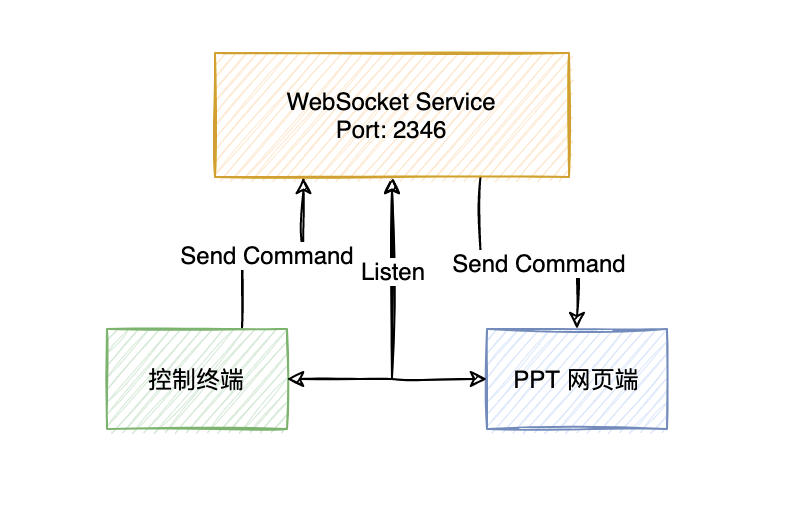
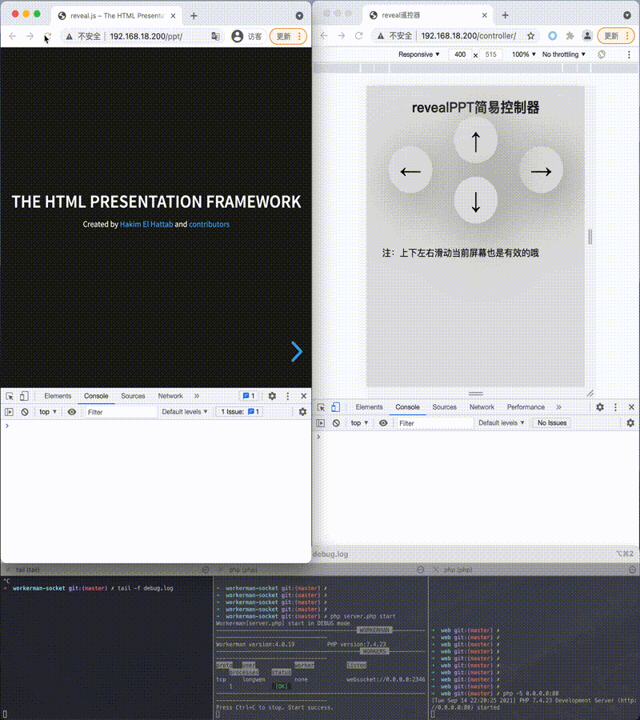
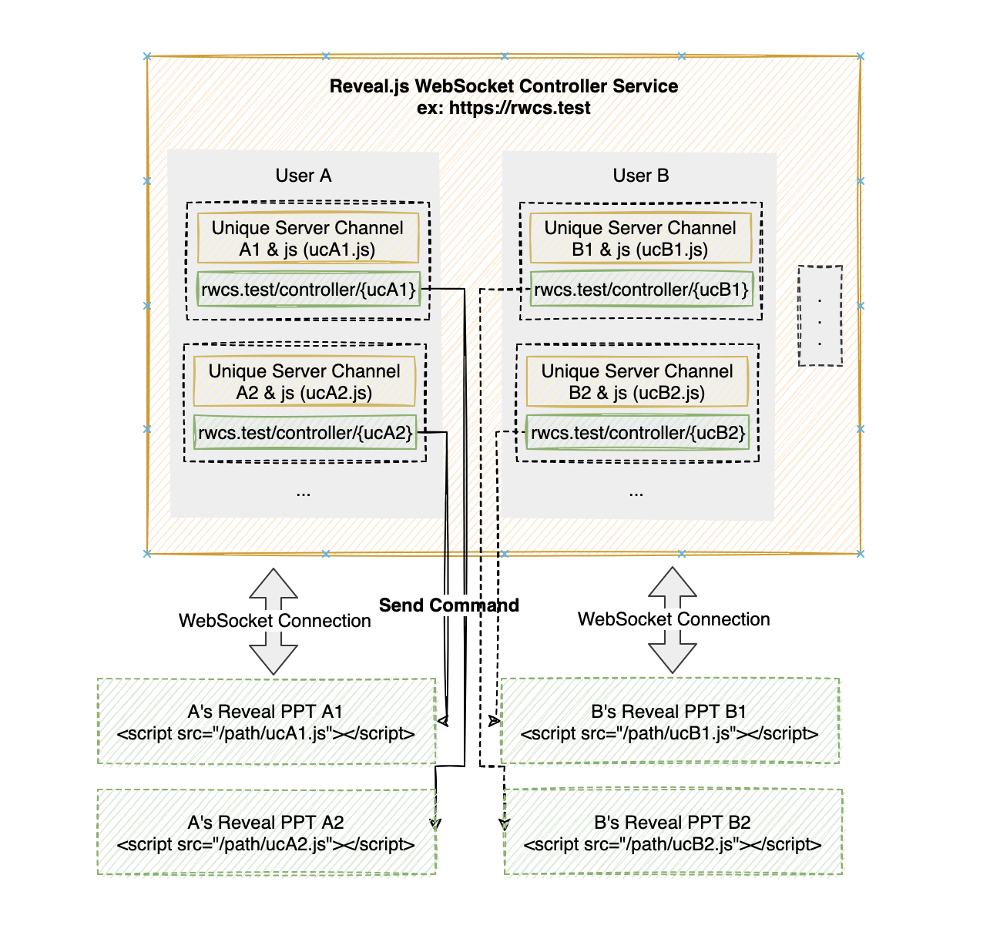

# 简单实现基于 WebSocket 的 revealjs PPT 远程控制器

## 背景

这个 idea 是在大学毕设答辩前萌发的，当时正学习实践前端知识，接触到了一个通过前端代码来编写并运行在浏览器中的 PPT 项目 [revealjs](https://revealjs.com/)


看完后当时的内心独白：

> 毕设答辩的 PPT 可以用这个来写，<ruby>
> 学 <rp>(</rp><rt>biāo</rt><rp>)</rp>
> 以 <rp>(</rp><rt>xīn</rt><rp>)</rp>
> 致 <rp>(</rp><rt>lì</rt><rp>)</rp>	
> 用 <rp>(</rp><rt>yì</rt><rp>)</rp>
> </ruby> ，不枉我学过前端技术；
>
> 有了 PPT 的页面，那翻页还需要鼠标一下一下点击？有没有**更好的替代翻页效果的方式**？
>
> 别人 PPT 演说都还需要配置无线翻页笔，有什么方法可以实现类似的操作呢？
>
> 我可不可以**使用手机远程控制** 通过 revealjs 编写的浏览器端的 **PPT 页面**呢？
>
> 查阅一些资料后，了解了 WebSocket 全双工通信协议[<sup>[1]</sup>](#referWebSocketWiki)，现代浏览器支持； 
>
> 由此想到，可以写一个有上下左右控制的页面，连接一个 WebSocket 服务，然后点击上下左右后下发「指令」到 WebSocket 服务，然后 PPT 页面也连接此 WebSocket 服务 ，最后 WebSocket 服务 转发 「指令」 给 PPT 页面，从而做出翻页操作。
>
> 
>
>
> NICE！🍻


## 目标

基于 WebSocket 和 reveal.js，实现通过手机终端能控制 使用 reveal.js 实现的 PPT 网页端，进行远程上下左右翻页的操作。

> 目前实现 一个控制器端控制一个 PPT 网页端

## 基本原理

PPT 网页端和控制器端同时连接 WebSocket Service，由控制器端发送翻页操作指令（上下左右）到 WebSocket Service，然后 WebSocket Service 通知 PPT 网页端，PPT网页端执行翻页操作指令。 




## 实现效果



将上图中由浏览器打开的控制端页面换为连接同一局域网的手机浏览器打开，就实现了最初的想法。

## 功能实现

源码地址： https://github.com/wenlong-date/ppt 

### 1. 使用 workerman 提供 WebSocket 服务

PPT 网页端和控制器端连接 WebSocket Service 后会简单的「自报家门」，初始化 PPT 网页端的 connection 和控制器的 connection，

file: [server.php](https://github.com/wenlong-date/ppt/blob/master/server.php)

```php
// ... 
(new PptSocketServer())->run();

class PptSocketServer
{
    const CONNECTION_TYPE_PPT = 'connection_ppt';
    const CONNECTION_TYPE_CONTROLLER = 'connection_controller';

    protected $worker;
    protected $globalUid = 0;
    protected $globalPptConnection;
    protected $globalControllerConnection;

    public function __construct(int $port = 2346)
    {
        $this->initWorker($port);
    }

    public function run()
    {
        Worker::runAll();
    }

    protected function initWorker(int $port)
    {
        $this->worker            = new Worker("websocket://0.0.0.0:" . $port);
        $this->worker->count     = 1;
        $this->worker->onConnect = [$this, 'handleConnection'];
        $this->worker->onMessage = [$this, 'handleMessage'];
        $this->worker->onClose   = [$this, 'handleClose'];

    }

    // 简单记录连接的 id 信息
    public function handleConnection($connection)
    {
        $connection->uid = ++$this->globalUid;
    }

    public function handleMessage($connection, $data)
    {
        // 初始化 PPT 网页端的 connection
        if ($this->setPptConnectionIfNull($connection, $data)) {
            Log::info('ppt online');
            return;
        }
        // 初始化 控制端页面的 connection
        if ($this->setControllerConnectionIfNull($connection, $data)) {
            Log::info('controller online');
            return;
        }

        // ...
    }

    public function handleClose($connection)
    {
        // 判断并销毁 PPT 网页端或者控制端页面的 connection
        $this->destructConnection($connection);

        Log::info($connection->uid . ' offline by close websocket');
    }

    protected function destructConnection($connection)
    {
        if (isset($connection->type) && $connection->type === self::CONNECTION_TYPE_PPT) {
            $this->globalPptConnection = null;
            Log::info('ppt offline');
            return true;
        }

        if (isset($connection->type) && $connection->type === self::CONNECTION_TYPE_CONTROLLER) {
            $this->globalControllerConnection = null;
            Log::info('controller offline');
            return true;
        }

        return true;
    }

    /**
     * 根据命令判断和初始化 PPT 网页端的 connection
     *
     * @param $connection
     * @param $data
     * @return bool
     */
    protected function setPptConnectionIfNull($connection, $data)
    {
        if (!is_null($this->globalPptConnection)) return false;
        if (!$this->requestConnectionIsPpt($data)) return false;

        $connection->type          = self::CONNECTION_TYPE_PPT;
        $this->globalPptConnection = $connection;
        return true;
    }

    /**
     * 根据命令判断和初始化控制端页面的 connection
     *
     * @param $connection
     * @param $data
     * @return bool
     */
    protected function setControllerConnectionIfNull($connection, $data)
    {
        if (!is_null($this->globalControllerConnection)) return false;
        if (!$this->requestConnectionIsController($data)) return false;

        $connection->type                 = self::CONNECTION_TYPE_CONTROLLER;
        $this->globalControllerConnection = $connection;
        return true;
    }

    public function requestConnectionIsPpt($data)
    {
        return $data === 'i am ppt';
    }

    public function requestConnectionIsController($data)
    {
        return $data === 'i am controller';
    }

}
```

### 2. 控制端页面发送「指令」给 WebSocket Service

file: [/web/controller/index.html](https://github.com/wenlong-date/ppt/blob/master/web/controller/index.html)

```javascript
// ...

var ws = new WebSocket('ws://' + location.hostname + ":2346");
ws.onopen = function () {
    ws.send('i am controller');
};
ws.onmessage = function (e) {
    console.log('controller get message from server: ' + e.data);
};

var $ = function (dom) {
    return document.getElementById(dom);
}
$('up').onclick = function () {
    sendCommand('up');
}
$('right').onclick = function () {
    sendCommand('right');
}
$('down').onclick = function () {
    sendCommand('down');
}
$('left').onclick = function () {
    sendCommand('left');
}

function sendCommand(status) {
    ws.send(status);
}

// ...
```

### 3. WebSocket Service 发送「指令」给 PPT 网页端

发送「指令」前 判断 PPT 网页端是否在线，以及只允许一个控制端页面进行「指令」的下发

file: [/web/controller/control.js](https://github.com/wenlong-date/ppt/blob/master/web/controller/control.js)

```php
// ...

class PptSocketServer
{
    // ...

    public function handleMessage($connection, $data)
    {
        // ...

        if (is_null($this->globalPptConnection)) {
            Log::info('ppt offline; cant control');
            return;
        }

        // 目前只允许一个控制器发送指令。
        if (!is_null($this->globalControllerConnection)
            && $connection->uid !== $this->globalControllerConnection->uid
        ) {
            Log::info('sorry, you are not correct controller ' . $connection->uid);
            return;
        }
        // 转发控制端「指令」到 PPT 网页端
        $this->globalPptConnection->send($data);
    }
    // ...

}
```

### 4. PPT 网页端执行翻页「指令」

file: [server.php](https://github.com/wenlong-date/ppt/blob/master/server.php)

```javascript
// ...

var ws = new WebSocket('ws://' + location.hostname + ":2346");
ws.onopen = function () {
    ws.send('i am ppt');
};
ws.onmessage = function (e) {
    console.log('ppt get message from server: ' + e.data);
    switch (e.data) {
        case 'up':
            Reveal.up();
            break;
        case 'right':
            Reveal.right();
            break;
        case 'down':
            Reveal.down();
            break;
        case 'left':
            Reveal.left();
            break;
        default:
            console.log('unSupport command : ' . e.data)
    }
};

// ...
```

## 本地运行

> **注意：** 如果要演示自己的 revealjs PPT 则需要先在 PPT 的首页 html 文件尾部中引入 control.js
> ```
>  <script src="/controller/control.js"></script>
> ```

1. git clone https://github.com/wenlong-date/ppt.git  && composer install
2. 将 web/ppt 目录下的文件 替换为你自己的 reveal.js PPT 相关的前端文件 (默认有demo演示用的 PPT)
3. 执行 php server.php start [-d]  （-d 后台运行）
4. 另一个窗口执行 cd web && php -S 0.0.0.0:80 (或者使用 Nginx 提供 Web 服务)
5. 网页端打开地址 http://{yourip}/ppt/
6. 同一局域网连接的手机浏览器打开地址为 http://{yourip}/ppt/ （会自动跳转到控制端页面）即可。（如果公网 IP 地址就没有局域网络限制了）

## Docker Image && Docker run

仓库中已经有 Dockerfile 文件，可以手动build。


1. 同时也可以使用 docker pull wenlongdotdate/websocketppt 获取镜像
2. 本地运行 docker run -it -p 2346:2346 -p 80:80 -d wenlongdotdate/websocketppt (可以选择自己的 PPT 前端文件目录 挂载 到容器的 /var/www/html/web/ppt 目录下)
3. 网页端打开 http://{yourip}/ppt/
4. 同一局域网连接的手机浏览器打开地址为 http://{yourip}/ppt/ （会自动跳转到控制端页面）即可。（如果公网 IP 地址就没有局域网络限制了）


## 更多想法

目前只是 一对一 的控制一个 PPT，功能很简陋。

可以考虑为不同用户提供一个针对 reveal.js 开发的网页 PPT 提供一个 WebSocket 网页控制端服务。

每个用户在后台可以创建一个 控制器资源， 控制器将会生成一个**唯一的通信频道**和 PPT 可以引入的 JavaScript 文件（连接 WebSocket 服务并通信）。

这样 **不同用户** 可以**通过手机浏览器控制**基于 Reveal.js 开发的**网页 PPT** 需要下面三步：

1. 创建 控制器 资源
2. reveal.js 的 PPT 引入 JavaScript 文件
3. 手机浏览器 扫描 当前控制器资源 控制器二维码





## 参考资料
<div id="referWebSocketWiki"></div>

- [1] [WebSocket Wikipedia](https://zh.wikipedia.org/wiki/WebSocket)
- [reveal.js 官网](https://revealjs.com/)
- [workderman 版本手册 - 基本流程](http://doc.workerman.net/development/process.html)
- [MDN Web Docs - Web API 接口参考 - WebSocket](https://developer.mozilla.org/zh-CN/docs/Web/API/WebSocket])
- [原生JS实现触摸滑动监听事件 - 掘金](https://juejin.cn/post/6973541673196322847)