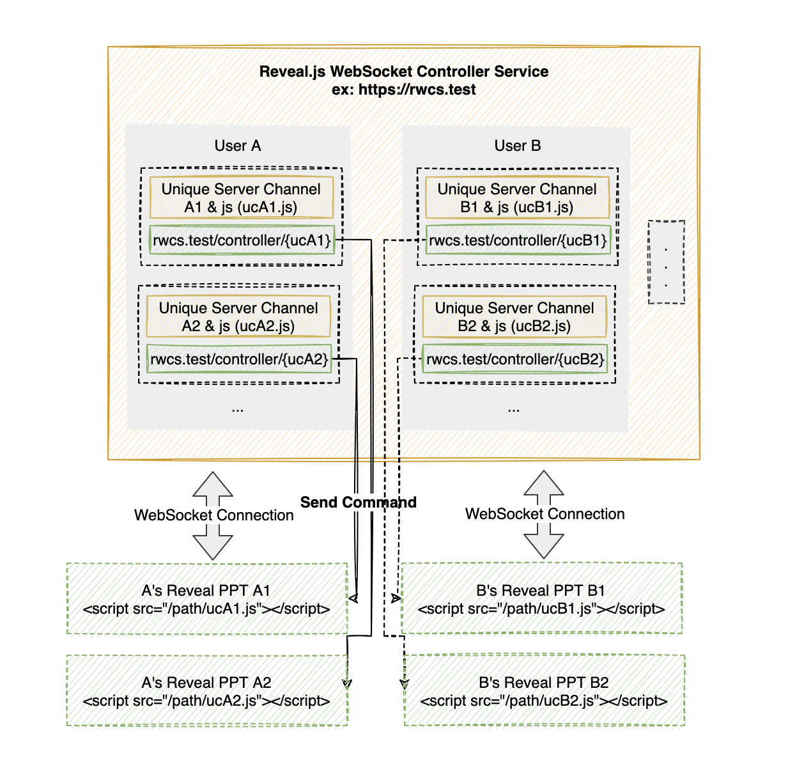

# 基于 WebSocket 的 PPT 远程控制器简单实现

## 背景

这个 idea 是在大学毕设答辩前萌发的，当时正学习实践前端知识，接触到了一个通过前端代码来编写实现 PPT 的项目 [revealjs](https://revealjs.com/)

看完后当时的内心独白：

> 毕设答辩的 PPT 可以用这个来写，<ruby>
> 学 <rp>(</rp><rt>biāo</rt><rp>)</rp>
> 以 <rp>(</rp><rt>xīn</rt><rp>)</rp>
> 致 <rp>(</rp><rt>lì</rt><rp>)</rp>	
> 用 <rp>(</rp><rt>yì</rt><rp>)</rp>
> </ruby> ，不枉我学过前端技术；
>
> 有了 PPT 的页面，那翻页还需要鼠标一下一下点击？有没有**更好的替代翻页效果的方式**？
>
> 别人 PPT 演说都还需要配置无线翻页笔，有什么方法可以实现类似的操作呢？
>
> 我可不可以**使用手机控制** 通过 revealjs 编写的浏览器端的 **PPT 页面**呢？
>
> 查阅一些资料后，了解了 WebSocket 全双工通信协议，现代浏览器支持； 
>
> 由此想到，可以写一个有上下左右控制的页面，连接一个 WebSocket 服务，然后点击上下左右后下发「指令」到 WebSocket 服务，然后 PPT 页面也连接此 WebSocket 服务 ，最后 WebSocket 服务 转发 「指令」 给 PPT 页面，从而做出翻页操作。
>
> 
>
>
> NICE！🍻

## 目标

基于 WebSocket 和 reveal.js，实现通过手机终端能控制 使用 reveal.js 实现的 PPT 网页端，进行远程上下左右翻页的操作。

> 目前实现 一个控制器端控制一个 PPT 网页端

## 基本原理

PPT 网页端和控制器端同时连接 WebSocket Server，由控制器端发送翻页操作指令（上下左右）到 WebSocket Server，然后 WebSocket Server 通知 PPT 网页端，PPT网页端执行翻页操作指令。 

## 功能实现

见源码 `server.php` 部分。

## 本地运行

1. `git clone https://github.com/wenlong-date/ppt.git`  && `composer install`
2. 将 web/ppt 目录下的文件 替换为你自己的 reveal.js PPT 相关的前端文件 (默认有demo演示用的 PPT)
3. 执行 `php server.php start` [-d]  （-d 后台运行）
4. 另一个窗口执行 `cd web && php -S 0.0.0.0:80` (或者使用 Nginx 提供 Web 服务)
5. 网页端打开地址 http://{yourip}/ppt/
6. 同一局域网连接的手机浏览器打开地址为 http://{yourip}/ppt/ （会自动跳转到控制端页面）即可。（如果公网 IP 地址就没有局域网络限制了）

## Docker Image && Docker run

仓库中已经有 Dockerfile 文件，可以手动build。

1. 同时也可以使用 `docker pull wenlongdotdate/websocketppt` 获取镜像
2. 本地运行 `docker run -it -p 2346:2346 -p 80:80 -d wenlongdotdate/websocketppt` (可以选择自己的 PPT 前端文件目录 挂载 到容器的 `/var/www/html/web/ppt` 目录下)
3. 网页端打开 http://{yourip}/ppt/
4. 同一局域网连接的手机浏览器打开地址为 http://{yourip}/ppt/ （会自动跳转到控制端页面）即可。（如果公网 IP 地址就没有局域网络限制了）

## 更多想法

目前只是 一对一 的控制一个 PPT，功能很简陋。

可以考虑为不同用户提供一个针对 reveal.js 开发的网页 PPT 提供一个 WebSocket 网页控制端服务。

每个用户在后台可以创建一个 控制器资源， 控制器将会生成一个**唯一的通信频道**和 PPT 可以引入的 JavaScript 文件（连接 WebSocket 服务并通信）。

这样 **不同用户** 可以**通过手机浏览器控制**基于 Reveal.js 开发的**网页 PPT** 需要下面三步：

1. 创建 控制器 资源
2. reveal.js 的 PPT 引入 JavaScript 文件
3. 手机浏览器 扫描 当前控制器资源 控制器二维码

